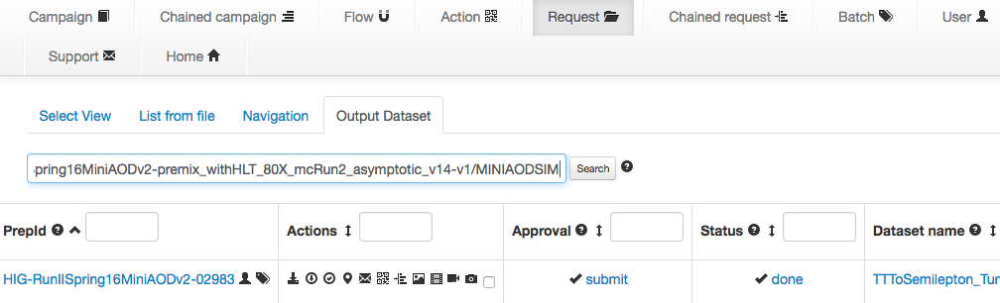
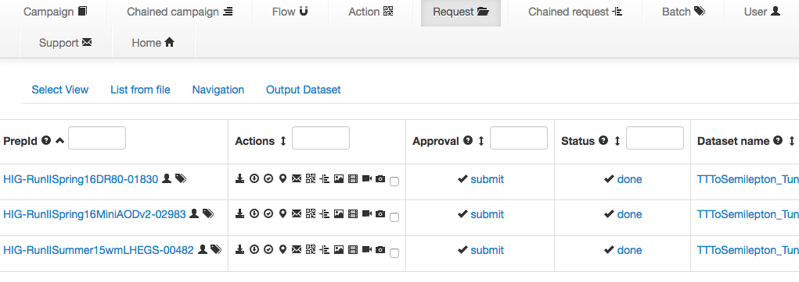
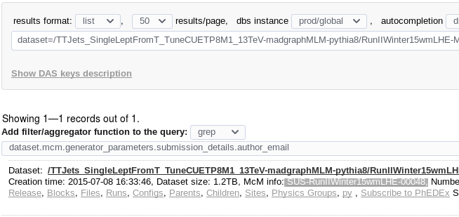
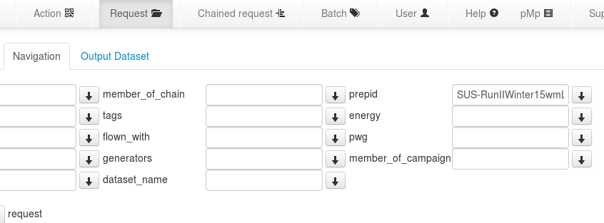

MC Generation
=============

.. contents::

Pulling in basic steps from McM
-------------------------------

We can look at either extracting the full chain in one query, or following
a specific LHE dataset (recommended).

Cloning the full chain
~~~~~~~~~~~~~~~~~~~~~~

To clone workflows from `McM`_, select a dataset to clone, i.e.::

    /TTToSemilepton_TuneCUETP8M2_ttHtranche3_13TeV-powheg-pythia8/RunIISpring16MiniAODv2-premix_withHLT_80X_mcRun2_asymptotic_v14-v1/MINIAODSIM

Then visit the `McM`_ homepage, and click the “Request” item at the top of
the page, and select “Output Dataset” below to paste the dataset to clone:

   Searching for workflows to produce a dataset.

By selecting the link in the column “Dataset name” in the search results,
all steps to reproduce the original dataset can be obtained:

   Workflows to completely reproduce a dataset.

Using LHE configurations only
~~~~~~~~~~~~~~~~~~~~~~~~~~~~~

If this yields too many results, an alternative is to follow the “parent”
links in DAS and look at the field “McM info” under the dataset name.  Then
search for the McM id by selecting “Navigation” and then filling in the
field “prepid”:

   Searching for the parent LHE dataset and its McM info.

   Using this prepid to search for the McM setup.

Extracting the setup
~~~~~~~~~~~~~~~~~~~~

Now the second to left icon |icon| in the search results can be used to download
the setup scripts.  For the `LHEGS` step:

.. _McM: https://cms-pdmv.cern.ch/mcm/

.. code-block:: shell

    #!/bin/bash
    source  /afs/cern.ch/cms/cmsset_default.sh
    export SCRAM_ARCH=slc6_amd64_gcc481
    if [ -r CMSSW_7_1_25/src ] ; then
     echo release CMSSW_7_1_25 already exists
    else
    scram p CMSSW CMSSW_7_1_25
    fi
    cd CMSSW_7_1_25/src
    eval `scram runtime -sh`

    export X509_USER_PROXY=$HOME/private/personal/voms_proxy.cert
    curl -s --insecure https://cms-pdmv.cern.ch/mcm/public/restapi/requests/get_fragment/HIG-RunIISummer15wmLHEGS-00482 --retry 2 --create-dirs -o Configuration/GenProduction/python/HIG-RunIISummer15wmLHEGS-00482-fragment.py
    [ -s Configuration/GenProduction/python/HIG-RunIISummer15wmLHEGS-00482-fragment.py ] || exit $?;

    scram b
    cd ../../
    cmsDriver.py Configuration/GenProduction/python/HIG-RunIISummer15wmLHEGS-00482-fragment.py \
      --fileout file:HIG-RunIISummer15wmLHEGS-00482.root \
      --mc --eventcontent RAWSIM,LHE \
      --customise SLHCUpgradeSimulations/Configuration/postLS1Customs.customisePostLS1,Configuration/DataProcessing/Utils.addMonitoring \
      --datatier GEN-SIM,LHE --conditions MCRUN2_71_V1::All --beamspot Realistic50ns13TeVCollision \
      --step LHE,GEN,SIM --magField 38T_PostLS1 \
      --python_filename HIG-RunIISummer15wmLHEGS-00482_1_cfg.py --no_exec -n 42 || exit $? ;

Repeat this for the `DR` step to see the following lines

.. code-block:: shell

    cmsDriver.py step1 \
      --filein "dbs:/TTToSemilepton_TuneCUETP8M2_ttHtranche3_13TeV-powheg-pythia8/RunIISummer15wmLHEGS-MCRUN2_71_V1-v1/GEN-SIM" \
      --fileout file:HIG-RunIISpring16DR80-01830_step1.root \
      --pileup_input "dbs:/Neutrino_E-10_gun/RunIISpring15PrePremix-PU2016_80X_mcRun2_asymptotic_v14-v2/GEN-SIM-DIGI-RAW" \
      --mc --eventcontent PREMIXRAW --datatier GEN-SIM-RAW --conditions 80X_mcRun2_asymptotic_v14 \
      --step DIGIPREMIX_S2,DATAMIX,L1,DIGI2RAW,HLT:25ns10e33_v2 --nThreads 4 --datamix PreMix --era Run2_2016 \
      --python_filename HIG-RunIISpring16DR80-01830_1_cfg.py --no_exec \
      --customise Configuration/DataProcessing/Utils.addMonitoring -n 960 || exit $? ;

    cmsDriver.py step2 \
      --filein file:HIG-RunIISpring16DR80-01830_step1.root \
      --fileout file:HIG-RunIISpring16DR80-01830.root \
      --mc --eventcontent AODSIM,DQM --runUnscheduled --datatier AODSIM,DQMIO \
      --conditions 80X_mcRun2_asymptotic_v14 \
      --step RAW2DIGI,RECO,EI,DQM:DQMOfflinePOGMC --nThreads 4 --era Run2_2016 \
      --python_filename HIG-RunIISpring16DR80-01830_2_cfg.py --no_exec \
      --customise Configuration/DataProcessing/Utils.addMonitoring -n 960 || exit $? ;

Note that this step is happening in ``CMSSW_8_0_14``.

And for the `MiniAOD` step (note again the used release, which is equivalent to the `DR` step)

.. code-block:: shell

    cmsDriver.py step1 \
      --filein "dbs:/TTToSemilepton_TuneCUETP8M2_ttHtranche3_13TeV-powheg-pythia8/RunIISpring16DR80-premix_withHLT_80X_mcRun2_asymptotic_v14-v1/AODSIM" \
      --fileout file:HIG-RunIISpring16MiniAODv2-02983.root \
      --mc --eventcontent MINIAODSIM --runUnscheduled --datatier MINIAODSIM \
      --conditions 80X_mcRun2_asymptotic_v14 \
      --step PAT --era Run2_2016 \
      --python_filename HIG-RunIISpring16MiniAODv2-02983_1_cfg.py --no_exec \
      --customise Configuration/DataProcessing/Utils.addMonitoring -n 960 || exit $? ;

Setup for FastSim
-----------------

General Advice from the TWiki
~~~~~~~~~~~~~~~~~~~~~~~~~~~~~

Note the following from the `FastSim TWiki`_ about `runTheMatrix.py` workflows:

    **FullSim:**

    * do not run harvesting (the 4th command printed by runTheMatrix.py)
    * do not run the ALCA step (the 5th command printed by runTheMatrix.py)
    * in the 2nd command printed by runTheMatrix.py

      *  replace the DIGI:pdigi_valid with DIGI (do not produce the truth collection 'trackingParticles')

    * in the 3rd command

      * remove ,EI,VALIDATION from the -s option
      * replace --eventcontent RECOSIM,DQM with --eventcontent AODSIM
      * replace --datatier GEN-SIM-DIGI-RECO,DQMIO with --datatier AODSIM

.. _FastSim TWiki: https://twiki.cern.ch/twiki/bin/view/CMSPublic/SWGuideFastSimulationExamples

Release Setup
~~~~~~~~~~~~~

Unfortunately, these steps don't work well with the McM workflows.  First,
a pile-up sample needs to be produced.  To set up the environment

.. code-block:: shell

    scram p CMSSW CMSSW_8_0_20
    cd CMSSW_8_0_20/src
    curl -s --insecure https://cms-pdmv.cern.ch/mcm/public/restapi/requests/get_fragment/HIG-RunIISummer15wmLHEGS-00482 --retry 2 --create-dirs -o Configuration/GenProduction/python/HIG-RunIISummer15wmLHEGS-00482-fragment.py
    git clone git@github.com:cms-ttH/ttH-TauMCGeneration.git ttH/TauMCGeneration
    eval `scram runtime -sh`
    scram b
    cd ../..

AODSIM
~~~~~~

To directly produce AODSIM using FastSim, the following ``cmsDriver.py``
command can be used:

.. code-block:: shell

    cmsDriver.py Configuration/GenProduction/python/HIG-RunIISummer15wmLHEGS-00482-fragment.py \
       -n 500 \
       --python_filename all_fast.py \
       --fileout file:all_fast.root \
       --pileup_input "dbs:/Neutrino_E-10_gun/RunIISpring16FSPremix-PUSpring16_80X_mcRun2_asymptotic_2016_v3-v1/GEN-SIM-DIGI-RAW" \
       --mc --eventcontent AODSIM --fast \
       --customise SimGeneral/DataMixingModule/customiseForPremixingInput.customiseForPreMixingInput \
       --customise ttH/TauMCGeneration/customGenFilter.customizeForGenFiltering \
       --datatier AODSIM --conditions auto:run2_mc --beamspot Realistic50ns13TeVCollision \
       --step LHE,GEN,SIM,RECOBEFMIX,DIGIPREMIX_S2,DATAMIX,L1,DIGI2RAW,L1Reco,RECO,HLT:@fake1 \
       --datamix PreMix \
       --era Run2_25ns \
       --no_exec \

Notice the second ``--customise`` parameter, which will set up a basic
filter after the generation step to trim the selected events.

Premixed pile-up is available from the following two datasets::

    /Neutrino_E-10_gun/RunIISpring16FSPremix-PUSpring16_80X_mcRun2_asymptotic_2016_v3-v1/GEN-SIM-DIGI-RAW
    /Neutrino_E-10_gun/RunIISummer16FSPremix-PUMoriond17_80X_mcRun2_asymptotic_2016_TrancheIV_v4-v1/GEN-SIM-DIGI-RAW

MINIAOD
~~~~~~~

As a final step, produce the `MiniAOD`:

.. code-block:: shell

    cmsDriver.py \
       -n 500 \
       --python_filename maod_fast.py \
       --fileout file:moad_fast.root \
       --filein file:all_fast.root \
       --mc --eventconcent MINIAODSIM --fast \
       --datatier MINIAODSIM --conditions auto:run2_mc \
       --step PAT --runUnscheduled \
       --no_exec

Filtering MiniAOD
-----------------

Something like the following can be added to a parameter set to filter MiniAOD:

.. code-block:: python

    process.load('ttH.TauMCGeneration.eventFilterMAOD_cfi')
    process.evpath = cms.Path(process.ttHfilter)
    process.output = cms.OutputModule(
        "PoolOutputModule",
        fileName=cms.untracked.string(options.outputFile),
        outputCommands=cms.untracked.vstring(['keep *']),
        SelectEvents=cms.untracked.PSet(SelectEvents=cms.vstring('evpath')),
        dataset=cms.untracked.PSet(filterName=cms.untracked.string(''))
    )
